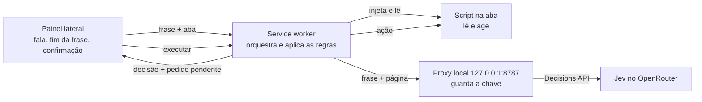

# Arquitetura

Como o navegador por voz funciona por dentro, para quem vai ler ou mudar o código. O que o produto é e as regras que
valem para tudo estão em `docs/product/vision.md`; os comandos para rodar e testar, no `CLAUDE.md`.

## Componentes e fluxo

| Parte            | Código                         | O que faz                                                                                  |
| ---------------- | ------------------------------ | ------------------------------------------------------------------------------------------ |
| Painel lateral   | `src/sidepanel/`               | Reconhece a fala, decide quando a frase terminou, pede confirmação e mostra o estado       |
| Service worker   | `src/background/`              | Lê a aba, chama o proxy, aplica as regras e executa a ação quando o painel pede            |
| Script na aba    | `src/pagina/`                  | Funções injetadas sob demanda: `lerPagina` e `agir`. Nenhum código fica rodando nas páginas |
| Regras           | `src/rules/`, `src/config/`    | Decisão (ignorar, esperar, confirmar, executar), lista de palavras perigosas e argumentos    |
| Proxy local      | `proxy/`                       | Único lugar com a chave do OpenRouter; monta o pedido ao Jev e devolve as respostas        |

Um comando, do começo ao fim:

1. A pessoa aperta "Falar" (ou Alt+J) e fala. O painel ouve uma frase por acionamento.
2. Depois de 700 ms sem o texto mudar, o painel manda a frase e o ID da aba ativa ao service worker.
3. O service worker injeta `lerPagina` na aba e manda a frase e a leitura ao proxy, que pergunta ao Jev.
4. As regras decidem. "Executar" e "confirmar" voltam ao painel com um pedido pendente; nada é executado ainda.
5. O painel pede a execução só se a frase ainda for a atual (a pessoa pode ter continuado falando) e, numa ação
   perigosa, só depois de um "sim" falado.

## Leitura da página

`src/pagina/leitura.js` devolve até 100 elementos acionáveis:

- **Candidatos:** links, botões, campos, `select`, `textarea`, `summary`, elementos com `onclick`, `tabindex` ou
  `contenteditable` e os roles interativos, no documento, em shadow roots abertos e em iframes da mesma origem.
- **Fora:** elementos ocultos e tudo o que está dentro de um campo editável (o que a pessoa escreveu).
- **Ordem:** primeiro os visíveis na tela, em ordem do DOM; depois os de fora, do mais perto ao mais longe. Elementos com
  o mesmo nome, papel e destino entram uma vez só.
- **Dados de cada um:** um ID nosso (`data-jev-id`), tag, role, tipo, nome acessível de até 80 caracteres, host e
  caminho dos links (sem query nem hash) e se está na tela.
- **Nunca saem do navegador:** valores de campos, texto de `textarea` e de campos editáveis, opção escolhida. Senha e
  cartão vão só com o tipo (`password`, `cartao`) e o rótulo.

A extensão não lê páginas `chrome://`, a Chrome Web Store, PDFs nem o conteúdo de iframes de outra origem; nesses
casos o painel avisa e nada vai ao Jev.

## Jev

O Jev (`typesafe/jev-1.13`) responde perguntas tipadas pela Decisions API do OpenRouter (`proxy/jev.js`):

| Pergunta           | Tipo     | Resposta                                                                   |
| ------------------ | -------- | -------------------------------------------------------------------------- |
| Intenção           | `choice` | `abrir_site`, `clicar`, `rolar`, `voltar`, `buscar` ou `nenhuma`, com confiança |
| Elemento           | `choice` | o ID de um dos elementos lidos ou `nenhum`, com confiança                  |
| É comando?         | `noul`   | probabilidade de "sim"                                                     |
| Terminou a frase?  | `noul`   | probabilidade de "sim"                                                     |
| É perigoso?        | `noul`   | probabilidade de "sim"                                                     |

O Jev não devolve texto livre. Por isso o site, a direção da rolagem e o termo de busca saem da própria frase, por
regra (`src/rules/argumento.js`): uma lista fixa de sites mais domínios falados ("exemplo ponto com"), "baixo/desce" e
"cima/sobe", e o resto da frase depois de "pesquisa", "busca" ou "procura". A busca abre o Google pela URL, porque
digitar texto ditado na página está fora do escopo do produto.

## Regras e limiares

`src/rules/decidir.js`, nesta ordem:

1. "É comando?" abaixo de 0,3 → ignorar.
2. "Terminou a frase?" abaixo de 0,5 → esperar mais fala por até 3 s; sem fala nova, descartar.
3. "É perigoso?" a partir de 0,35, ou uma palavra da lista fixa na frase ou no nome do elemento → confirmar.
4. Senão → executar.

Os valores ficam só em `src/config/limiares.js` e vieram das medições da prova de conceito, com o Jev real: conversas
ficaram até 0,16 em "É comando?" e comandos a partir de 0,42; "manda a mensagem" ficou em 0,50 em "É perigoso?". São
valores iniciais; a calibração com uso ainda não foi feita.

## Fim da frase

Só tempo não basta: o resultado final da API de fala corta frases com uma pausa no meio, um timer curto corta todas, e
um timer longo soma mais de 1 s de espera. Nenhum deles reconhece frase incompleta ("clica no"). Por isso o painel
espera 700 ms sem o texto mudar e pergunta ao Jev se a frase terminou, na mesma chamada do quiz
(`src/sidepanel/frase.js`). A confirmação de ação perigosa só aceita uma resposta que seja inteira "sim"; qualquer
outra coisa, ou 5 s de silêncio, cancela.

## Segurança

As regras completas estão na skill `.claude/skills/seguranca-acoes-voz/SKILL.md`, com um teste para cada uma.

- A chave do OpenRouter fica só no `.env` do proxy. O proxy escuta em 127.0.0.1 e recusa qualquer pedido sem a `Origin`
  da extensão (`EXTENSAO_ID`), para uma página aberta não conseguir usar a chave.
- O service worker só aceita mensagens de páginas da própria extensão e nunca executa uma ação sem o pedido do painel.
- O log (`src/log.js`, `proxy/log.js`) só registra eventos, decisões, probabilidades e tempos; frase, URL e conteúdo de
  página são descartados. O lint proíbe `console` fora desses dois arquivos.

## Latência

Da última mudança do texto até a ação, medido com voz: p50 de cerca de 1,1 s, contra a meta de 2 s do produto. A pausa
de 700 ms é a maior parte; o Jev responde em cerca de 300 ms. O tempo entre o fim real da fala e a última mudança do
texto não é medido.
