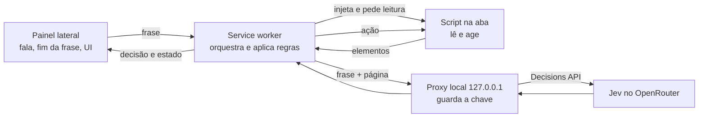

# Spec: Core do navegador por voz

Intent: ./intent.md (2026-10-01) · Status: approved · Autor: Claude + Flavio Vieira Leao
Skills aplicadas: `seguranca-acoes-voz`, `docs/product/vision.md` (princípios e restrições)

<!--
Etapa 2 — DESIGN. Requisitos + design em um único documento, conforme as skills
(políticas) do projeto. Pronto para entregar à engenharia.
Status: draft → approved (product owner na conversa, tech lead quando risco alto; o Claude grava).
A aprovação dispara a Etapa 3 (plan.md).
-->

## 1. Resumo

Uma extensão MV3 do Chrome em que a pessoa aperta "Falar" no painel lateral, diz um comando em português e a aba ativa
executa: abrir site, clicar, rolar, voltar ou buscar. A frase passa pela leitura da página, pelo quiz do Jev e por
regras com limiares; conversa é ignorada, frase incompleta espera, e ação perigosa pede um "sim" falado. A chave do Jev
fica num proxy local, fora da extensão. O desenho segue o que a POC 001 mediu (`docs/changes/001-feasibility-poc/`, só
na cópia local do engenheiro).

## 2. Requisitos funcionais

| ID    | Requisito                                                                                                                                                            | Origem no intent                         | Prioridade |
| ----- | -------------------------------------------------------------------------------------------------------------------------------------------------------------------- | ---------------------------------------- | ---------- |
| RF-01 | Ouvir por botão "Falar" no painel lateral e por um atalho de teclado; cada acionamento ouve uma frase.                                                               | Resultado proposto; pergunta de ativação | Must       |
| RF-02 | Na primeira vez, pedir o microfone numa página da extensão; depois, o painel ouve sem novo pedido.                                                                   | Resultado proposto                       | Must       |
| RF-03 | O painel mostra a frase reconhecida e o estado: ouvindo, pensando, esperando o resto, confirmando, feito, ignorado, cancelado ou erro, com o motivo.                 | Resultado proposto ("o painel mostra")   | Must       |
| RF-04 | Fim da frase: depois de 700 ms sem o texto mudar, a frase vai ao Jev; com "Terminou a frase?" abaixo do limiar, espera mais fala por até 3 s e então descarta.         | Cenário 5                                | Must       |
| RF-05 | Ler a aba ativa a cada frase: candidatos, exclusões e escolha dos 100 do E3 (viewport primeiro, em ordem do DOM), no frame principal, shadow roots abertos e iframes da mesma origem. | Resultado proposto                       | Must       |
| RF-06 | Elementos com o mesmo nome, role e destino entram uma vez só entre os 100.                                                                                            | Critério ≥ 90% nos cenários 1 e 2        | Should     |
| RF-07 | Enviar ao Jev, pelo proxy local, a frase, a URL, o título e os elementos, e receber as cinco respostas com confiança.                                                | Resultado proposto                       | Must       |
| RF-08 | Decidir com os limiares de um arquivo só: "É comando?" abaixo do limiar → ignorar; "Terminou?" abaixo → esperar; perigoso (lista fixa ou Jev) → confirmar; senão executar. | Cenários 3, 4 e 5                        | Must       |
| RF-09 | Executar: abrir site, clicar no elemento escolhido (clique de verdade), rolar para cima ou para baixo, voltar e buscar.                                               | Resultado proposto; cenários 1 e 2       | Must       |
| RF-10 | Ação perigosa: o painel mostra "Confirma? <ação> <elemento>" e ouve uma frase; só "sim" executa; qualquer outra resposta ou 5 s de silêncio cancela.                 | Cenário 4                                | Must       |
| RF-11 | Em página que a extensão não lê (`chrome://`, Chrome Web Store, PDF), o painel diz que não consegue ler a página e nada é enviado ao Jev.                             | Restrição do produto (fora do escopo)    | Must       |
| RF-12 | O painel deixa escolher a transcrição na nuvem (padrão) ou no modo local e diz para onde vai o áudio e o conteúdo da página.                                          | Pergunta nuvem ou local; princípio de dados | Should   |

## 3. Requisitos não funcionais

| ID     | Categoria             | Requisito mensurável                                                                                                    |
| ------ | --------------------- | ----------------------------------------------------------------------------------------------------------------------- |
| RNF-01 | Desempenho            | p50 ≤ 2 s da última mudança do texto até a ação, em ≥ 10 falas de "clica em entrar" na página de teste.                  |
| RNF-02 | Desempenho            | Leitura da página com p50 ≤ 200 ms; chamada ao Jev com tempo limite de 3 s, que vira estado "erro" no painel.           |
| RNF-03 | Segurança/Privacidade | Nenhum valor de campo, `textarea`, `contenteditable` ou opção selecionada sai do navegador; senha e cartão só com tipo e rótulo. |
| RNF-04 | Segurança             | A chave do OpenRouter existe só no `.env` do proxy; o proxy escuta só em 127.0.0.1 e recusa pedido sem a `Origin` da extensão. |
| RNF-05 | Privacidade           | Nenhum log persistente com transcrição ou conteúdo de página, na extensão ou no proxy; só IDs, decisões e tempos.        |
| RNF-06 | Custo                 | Uma chamada ao Jev por frase enviada (cerca de US$ 0,00014 cada na POC 001).                                            |
| RNF-07 | Acessibilidade/UX     | O painel funciona só com teclado e anuncia mudança de estado por `aria-live`.                                           |
| RNF-08 | Compatibilidade       | Chrome desktop 153 ou mais novo (versão medida na POC 001), em pt-BR.                                                    |

## 4. Design

### 4.1 Visão geral da arquitetura



- **Painel lateral:** reconhecimento de fala (Web Speech API, contínuo durante a frase), fim da frase, confirmação
  falada e estados. Contexto escolhido na POC: tem os controles e mantém o microfone depois da primeira concessão.
- **Service worker:** recebe a frase, injeta o script na aba ativa sob demanda (`chrome.scripting`), chama o proxy,
  aplica as regras, executa ou devolve "confirmar" ao painel.
- **Script na aba:** injetado a cada comando, sem ouvintes permanentes nas páginas. Lê os elementos e marca cada um com
  um ID nosso; executa clique e rolagem pelo ID da última leitura.
- **Regras:** módulo puro com os limiares (`src/config/limiares.js`) e a lista fixa de palavras perigosas
  (`src/rules/`), testável sem navegador.
- **Proxy local:** processo Node em 127.0.0.1 que lê `OPENROUTER_API_KEY` do `.env`, monta o pedido da Decisions API e
  devolve as respostas. É o único lugar com a chave.

### 4.2 Integração com o código existente

Não há código de produto. O código da POC (`_poc/`, ignorado pelo git) é referência e não é copiado como está: os
gatilhos de teste por evento de DOM (`jev-poc:ler`, `jev-poc:comando`) e o content script declarado em `<all_urls>` não
entram. Estrutura proposta, alinhada aos evals de exemplo e ao `CLAUDE.md`:

- `src/`: a extensão (manifest, painel, service worker, script da aba, `src/rules/`, `src/config/`).
- `proxy/`: o proxy local.
- `tests/`: testes automatizados (`npm test`), com fixtures em `tests/fixtures/`.
- `package.json` com `test` e `lint`; o plan preenche "Comandos" e "Verificando seu trabalho" no `CLAUDE.md`.

### 4.3 Contratos de dados / interfaces

Leitura da página (script da aba → service worker):

```json
{
  "url": "https://pt.wikipedia.org/wiki/Brasil",
  "titulo": "Brasil – Wikipédia",
  "ms": 7,
  "elementos": [
    { "id": "j7", "tag": "a", "role": "link", "tipo": null, "nome": "Iniciar sessão", "destino": "/w/index.php", "noViewport": true }
  ]
}
```

URL sem query nem hash; `nome` com até 80 caracteres; `destino` só host e caminho; no máximo 100 elementos.

Proxy local: `POST http://127.0.0.1:<porta>/jev`, corpo `{ "frase": "...", "pagina": <leitura> }`, resposta
`{ "ms": 307, "respostas": { "intencao": {"escolha": "clicar", "confianca": 0.9}, "elemento": {...}, "comando": 0.86,
"terminou": 0.82, "perigoso": 0.05 } }`. Erro: `{ "erro": "<código>" }` com status 4xx/5xx, sem conteúdo do pedido.
Pedido sem a `Origin` `chrome-extension://<id da extensão>` recebe 403.

Pedido ao Jev: as perguntas tipadas da POC 001 (`choice` para intenção e elemento, `noul` para comando, terminou e
perigoso), com as intenções `abrir_site`, `clicar`, `rolar`, `voltar`, `buscar` e `nenhuma`.

Argumento da ação, por regra sobre a frase (o Jev não devolve texto):

- abrir site: nome conhecido de uma lista fixa (YouTube, Google, Wikipédia, g1, Mercado Livre, GitHub, Gmail) ou
  domínio falado ("abre exemplo ponto com");
- rolar: "baixo", "desce" → para baixo; "cima", "sobe" → para cima;
- buscar: o resto da frase depois do verbo ("pesquisa", "busca", "procura") vira o termo de uma busca no Google, aberta
  por URL na aba ativa.

Limiares (`src/config/limiares.js`), valores iniciais da POC 001: `comando: 0.3`, `terminou: 0.5`, `perigoso: 0.35`,
`pausaMs: 700`, `esperaMaxMs: 3000`, `confirmacaoMs: 5000`.

### 4.4 Fluxos e estados

- Caminho feliz: Falar → ouvindo → 700 ms sem mudança → pensando → leitura + Jev → regras → executar → feito.
- Conversa: "É comando?" < 0,3 → ignorado; nada acontece.
- Incompleta: "Terminou?" < 0,5 → esperando o resto; fala nova reinicia o ciclo com a frase inteira; 3 s sem fala →
  descartado.
- Perigosa: lista fixa ou "É perigoso?" ≥ 0,35 → confirmando; "sim" → executa; outra resposta ou 5 s → cancelado.
- Página que não lê: injeção falha → erro "não consigo ler esta página"; nada é enviado.
- Elemento escolhido `nenhum` numa intenção `clicar`, site não reconhecido ou direção ausente → erro com o motivo.
- Proxy fora do ar, 403 ou tempo limite → erro "Jev indisponível"; nada é executado.

### 4.5 Alternativas consideradas

| Opção                                    | Prós                                                  | Contras                                                                       | Decisão                         |
| ---------------------------------------- | ----------------------------------------------------- | ----------------------------------------------------------------------------- | ------------------------------- |
| Chave no proxy local (Node, 127.0.0.1)   | sem infra; combina com o uso local do intent          | o usuário roda mais um processo; localhost precisa checar `Origin`            | escolhida                       |
| Chave num servidor próprio               | sem processo local; serve para publicar depois        | deploy, autenticação e custo; publicação está fora do escopo                  | descartada agora                |
| Chave guardada na extensão               | mais simples                                          | qualquer um com a extensão lê a chave; viola a restrição do intent            | descartada                      |
| Script injetado sob demanda              | nenhum ouvinte nas páginas; lê o DOM do momento        | injeção a cada comando (poucos ms)                                            | escolhida                       |
| Content script declarado em todas as páginas | pronto ao chegar o comando                         | código rodando em toda página; ponto de ataque permanente                     | descartada                      |
| Argumento por regra sobre a frase        | mediu 6 de 6 na POC; sem chamada extra                | lista fixa de sites; frases fora do padrão falham                             | escolhida                       |
| Argumento como pergunta `choice` ao Jev  | entende variações                                     | não testado; site livre e termo de busca continuam fora                       | descartada agora                |
| JavaScript puro, sem bundler             | código da POC aproveitável; nada para compilar        | sem checagem de tipos                                                         | escolhida (detalhe no plan)     |
| TypeScript com bundler                   | tipos                                                 | passo de build e configuração para um core pequeno                            | descartada                      |
| Buscar digitando no campo de busca do site | busca no próprio site                               | digitar texto ditado está fora do escopo do produto                           | descartada                      |

## 5. Conformidade com políticas (skills)

| Política/skill                                      | Como o design atende                                                                                                   | Status |
| --------------------------------------------------- | ---------------------------------------------------------------------------------------------------------------------- | ------ |
| `docs/product/vision.md` (princípios e restrições)  | Chrome desktop pt-BR; dados sensíveis não saem (RNF-03); perigosa só com "sim" (RF-10); conversa e frase incompleta não agem (RF-04, RF-08); painel diz o destino dos dados (RF-12); páginas que não lê, avisadas (RF-11); buscar sem digitar texto ditado | ok |
| `seguranca-acoes-voz` regra 1 (confirmação)         | lista fixa em `src/rules/` OU Jev ≥ limiar → confirmar (RF-08, RF-10)                                                  | ok     |
| `seguranca-acoes-voz` regra 2 (dados sensíveis)     | leitura nunca lê `value`; senha e `cc-*` só com tipo e rótulo; teste com fixture de valores plantados                  | ok     |
| `seguranca-acoes-voz` regra 3 (limiares)            | `src/config/limiares.js` único; nenhuma ação com comando < limiar ou terminou < limiar                                 | ok     |
| `seguranca-acoes-voz` regra 4 (sem logs de conteúdo) | extensão e proxy registram só IDs, decisões e tempos (RNF-05)                                                         | ok     |
| `seguranca-acoes-voz` regra 5 (teste por regra)     | CA-01 exige ao menos um teste automatizado por regra                                                                   | ok     |

## 6. Áreas de preocupação

1. **Segredo e processo local.** O proxy exige `npm run proxy` com o `.env` antes de usar a extensão. Impacto: um passo a
   mais para o usuário e a chave num arquivo local. Dono: você (segredos). Recomendação: aceitar para este item, com o
   `.env` no `.gitignore` (já está) e o hook `block-secrets.sh`; servidor próprio só quando a publicação entrar no
   escopo.
2. **Proxy em localhost exposto a páginas.** Qualquer página aberta pode tentar chamar `127.0.0.1` e gastar a chave.
   Mitigação: recusar pedido sem a `Origin` da extensão (o navegador não deixa página falsificar `Origin`) e não
   responder CORS para outras origens. Teste automatizado no CA-07.
3. **Lista fixa de palavras perigosas incompleta.** Na POC, "manda a mensagem" ficou em 0,50 no Jev, e "manda" não
   está na lista da skill, que diz "enviar". Dono: você (política). Recomendação: a lista em `src/rules/` cobre as
   formas verbais e sinônimos usuais (manda, apaga, fecha o pedido) além dos verbos da skill.
4. **Clique de verdade em sites reais.** A POC só destacou elementos em sites reais. Um elemento errado com o Jev
   confiante executa. Mitigação: limiares, trava de perigo e o painel mostrando o que foi clicado. A calibração com uso
   está fora do escopo.
5. **Medida de latência.** O RNF-01 conta da última mudança do texto, não do fim real da fala, que nenhum experimento
   mediu. A meta do `vision.md` ("fim da fala") fica aproximada.
6. **Acerto nos cenários 1 e 2.** A transcrição errou "sign in" 3 de 3 vezes e trocou "rola" por "olha" em 3 de 8 na
   POC. Botões em inglês e o verbo "rolar" são o maior risco para os ≥ 90%. O conjunto de teste do CA-04 usa frases já
   transcritas e não mede esse erro; o roteiro falado do CA-05 mede.
7. **Tamanho do item.** O engenheiro escolheu o core num item só. O plan precisa de passos pequenos com fim verificável.
8. **`buscar` por URL do Google.** Leva o termo ao Google mesmo quando a pessoa está noutro site. É a forma de buscar
   sem digitar texto ditado na página (fora do escopo do produto).

## 7. Classificação de risco

- Nível: alto
- Motivo: executa ações em sites reais, inclusive cliques que podem ser irreversíveis (trava de segurança), manipula um
  segredo (chave do OpenRouter) e envia conteúdo de página a terceiros (Jev) e áudio ao Google.
- Aprovação necessária: product owner + tech lead + dono da política `seguranca-acoes-voz`. Neste repositório os três
  são a mesma pessoa.

## 8. Critérios de aceitação (verificáveis)

- [ ] CA-01 `npm test` passa, com ao menos um teste por regra da `seguranca-acoes-voz`: confirmação (lista fixa e Jev),
      dados sensíveis, limiares (ignorar e esperar), sem logs de conteúdo.
- [ ] CA-02 `npm run lint` termina sem warnings.
- [ ] CA-03 Teste da leitura sobre `tests/fixtures/pagina-teste.html` com senha, cartão, input, textarea e
      `contenteditable` preenchidos: nenhum valor plantado aparece no resultado; senha e cartão aparecem só com tipo e
      rótulo.
- [ ] CA-04 Conjunto de teste de frases e snapshots de páginas públicas, rodado contra o Jev pelo proxy (`npm run
      eval`): ≥ 90% de acerto nos cenários 1 e 2, 0 caso perigoso decidido como "executar" e ≤ 5% de conversas
      decididas como comando.
- [ ] CA-05 Roteiro falado registrado em `attachments/`: os 5 cenários nos 6 sites da POC 001 e na página de teste, com
      clique de verdade na página de teste, "sim" executando e "não" ou silêncio cancelando a ação perigosa.
- [ ] CA-06 RNF-01 medido com voz: p50 ≤ 2 s em ≥ 10 falas de "clica em entrar" na página de teste.
- [ ] CA-07 Teste automatizado do proxy: pedido sem `Origin` ou com outra origem recebe 403; com a `Origin` da extensão,
      200.
- [ ] CA-08 `grep -r OPENROUTER src/` não encontra nada, e nenhum arquivo versionado contém a chave.
- [ ] CA-09 Com a aba em `chrome://extensions`, o painel mostra "não consigo ler esta página" e o proxy não recebe
      pedido.

## 9. Perguntas resolvidas e pendentes

- Resolvida: onde fica a chave do Jev → proxy local em 127.0.0.1, com checagem de `Origin` (seção 4.5; preocupação 1).
  A aprovação deste spec é a decisão.
- Resolvida: como a pessoa ativa a escuta → botão "Falar" no painel e atalho de teclado, uma frase por acionamento. A
  escuta contínua depende do reconhecimento em segundo plano, que não foi medido.
- Resolvida: nuvem ou local → escolha no painel, nuvem como padrão (RF-12).
- Resolvida: limiares iniciais → os provisórios da POC 001, em `src/config/limiares.js`.
- Resolvida: argumento → regra sobre a frase; "abrir site" conhece a lista fixa da seção 4.3 e domínios falados.
- Pendente: público exato do produto (pergunta do `vision.md`). Não bloqueia.

## Decisão

approved por Flavio Vieira Leao na conversa em 2026-10-01, como product owner, tech lead e dono da política
`seguranca-acoes-voz` (risco alto).
