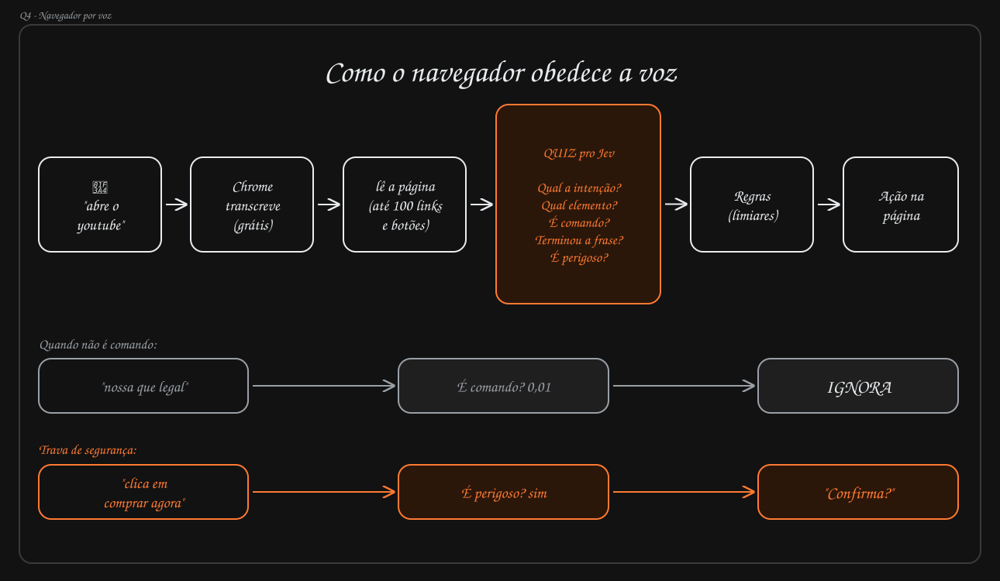

# Produto: navegador por voz

Autor: Flavio (produto) · Status: approved · Atualizado: 2026-10-01

<!--
Documento de produto: o que o produto é, para quem e sob quais princípios. Vale para todos os itens em
docs/changes/<NNN-slug>/. Não é um item: não passa por spec, plan e build nem fica "done".
Sem solução técnica: a arquitetura vai nos specs e na seção Arquitetura do CLAUDE.md.
Status: draft → approved (commit é a assinatura). Para mudar depois de aprovado, o humano volta para draft.
Cada intent herda as restrições daqui e lista só as próprias; o spec confere conformidade com este documento.
Ideias, problemas e bugs não entram aqui: vão para docs/backlog/.
-->

## Visão

Controlar o Chrome falando. A pessoa diz um comando em português ("abre o youtube", "clica em entrar", "rola pra baixo")
e o navegador executa a ação na página aberta.

Usar o navegador exige mouse e teclado. Para quem está com as mãos ocupadas, tem limitação motora ou quer mais
agilidade, falar é mais natural. Os assistentes de voz de hoje abrem sites, mas não "enxergam" a página: não sabem qual
botão clicar. A proposta junta transcrição de voz, leitura da página e um modelo, o Jev, que entende a intenção e
escolhe o elemento certo.

## Como funciona, na visão do usuário

1. A pessoa fala um comando.
2. O Chrome transcreve a fala.
3. A página aberta é lida: até 100 links e botões.
4. O Jev responde um quiz sobre a frase:

   | Pergunta          | Para quê                                    |
   | ----------------- | ------------------------------------------- |
   | Qual a intenção?  | abrir site, clicar, rolar, voltar, buscar…  |
   | Qual elemento?    | qual dos elementos lidos da página é o alvo |
   | É comando?        | separar comando de conversa comum           |
   | Terminou a frase? | não agir no meio da fala                    |
   | É perigoso?       | compras, exclusões, envios, pagamentos      |
   | Qual o argumento? | o site, o termo de busca ou a direção       |

5. As regras aplicam limiares de confiança às respostas e decidem: executar, ignorar ou pedir confirmação.
6. A ação acontece na página.

Os passos descrevem o conceito. Como cada um é implementado (formato do produto, API de transcrição, o que é o Jev) é
decisão dos specs.

## Cenários de referência

1. **Comando simples:** "abre o youtube" → abre youtube.com.
2. **Clique na página:** "clica em entrar" → clica no botão "Entrar" certo.
3. **Não é comando:** "nossa que legal" → É comando? 0,01 → ignora, nada acontece.
4. **Trava de segurança:** "clica em comprar agora" → É perigoso? sim → pergunta "Confirma?" e só executa depois de
   "sim".
5. **Frase incompleta:** "clica no…" → espera a frase terminar, não age.

## Princípios e restrições

Valem para todo item. Um intent que precise violar algum deles muda primeiro este documento.

- Plataforma: Chrome no desktop, em português do Brasil.
- Senhas, dados de cartão e conteúdo de campos preenchidos nunca saem do navegador.
- Nenhuma ação perigosa sem confirmação explícita da pessoa.
- Conversa comum nunca vira ação, e nada acontece no meio de uma frase.
- A pessoa sabe para onde vão os dados: a transcrição gratuita do Chrome envia o áudio ao Google, exceto no modo local,
  que processa a fala no computador, e o conteúdo da página vai para o Jev.

As regras de segurança detalhadas, com um teste para cada, estão na skill `seguranca-acoes-voz`.

## Fora do escopo do produto

Até nova decisão registrada aqui:

- Preencher formulários longos ou digitar textos ditados.
- Controlar várias abas ou janelas ao mesmo tempo.
- Idiomas além do português do Brasil.
- Navegadores além do Chrome.
- Funcionamento offline.
- Páginas onde a extensão não lê o conteúdo, medidas na POC 001: páginas internas do Chrome (`chrome://`), Chrome Web
  Store, PDFs e o conteúdo de iframes de outra origem.

## Métricas de sucesso

Metas da primeira versão, medidas num conjunto de teste de sites comuns:

- ≥ 90% dos comandos dos cenários 1 e 2 executados corretamente.
- 0 ações perigosas executadas sem confirmação.
- ≤ 5% de falsos positivos (conversa tratada como comando).
- ≤ 2 s entre o fim da fala e a ação (meta inicial, a validar).

## Riscos

- **Privacidade:** o áudio vai para o Google e o conteúdo da página vai para o Jev. Mitigação: deixar isso claro para a
  pessoa e nunca enviar dados sensíveis (senhas, campos de cartão).
- **Ação errada:** clicar no elemento errado ou agir sobre conversa comum. Mitigação: limiares e confirmação.
- **Ação irreversível sem querer:** compra ou exclusão disparada por engano. Mitigação: trava de segurança obrigatória.
- **Páginas grandes:** com mais de 100 elementos clicáveis, algo fica de fora da leitura. Mitigação candidata, não
  testada: quando o alvo não está entre os 100, rolar a página e ler de novo.
- **Microfone sempre ouvindo:** consumo, privacidade e ativações acidentais. Mitigação: depende do modo de ativação
  (pergunta em aberto).

## Glossário

- **Jev:** o modelo que responde o quiz sobre cada frase. O que ele é, onde roda e quanto custa está em aberto.
- **Quiz:** as perguntas que o Jev responde para cada frase (intenção, elemento, é comando?, terminou a frase?, é
  perigoso?), cada uma com uma confiança, mais o argumento da intenção (site, termo de busca ou direção).
- **Regras (limiares):** os valores de confiança que decidem entre executar, ignorar ou pedir confirmação.
- **Ação perigosa:** compra, pagamento, exclusão, envio ou outra ação difícil de desfazer. Basta a lista fixa de
  palavras-chave ou o julgamento do Jev marcar como perigosa (`.claude/skills/seguranca-acoes-voz/SKILL.md:11`).
- **Trava de segurança:** o pedido de "Confirma?" antes de uma ação perigosa; ela só executa depois do "sim".

## Perguntas em aberto

De produto:

- [ ] Quem é o público exato?
- [ ] O que é o Jev (modelo próprio, agente, API externa), onde roda e quanto custa por chamada? Dado da POC 001: o
      modelo de decisão `typesafe/jev-1.13`, pela Decisions API do OpenRouter, respondeu o quiz com p50 de 307 ms a
      US$ 0,00014 por chamada. Onde fica a chave de acesso em produção, sem expô-la na extensão, também está em aberto.
- [ ] Como a pessoa ativa a escuta: escuta contínua, palavra de ativação ou botão para falar? A POC 001 não mediu o
      reconhecimento com a aba em segundo plano, do qual a escuta contínua depende.
- [ ] A transcrição fica na nuvem do Google ou no modo local? Na POC 001, a nuvem acertou 27 de 30 frases e o modo
      local, 26 de 30, com latência parecida; só o local não envia o áudio.
- [x] O que conta como perigoso: lista fixa, julgamento do Jev ou ambos? Resolvida pela skill `seguranca-acoes-voz`:
      basta um dos dois.

Técnicas, para uma POC ou para o spec do primeiro item. As respostas vêm da POC 001 (2026-10-01): um falante, uma
máquina e seis sites públicos, então indicam viabilidade, mas não provam as metas.

- [x] A Web Speech API (`webkitSpeechRecognition`) atende em qualidade e latência para pt-BR, e funciona dentro de uma
      extensão (service worker ou offscreen document) ou só numa página? Sim, no limite: 27 de 30 frases corretas e
      cerca de 0,7 s de espera depois da última palavra. Roda em offscreen document, side panel, aba da extensão e
      content script; no service worker, não. Termos em inglês ("sign in") e "rola" (que vira "olha") são os erros
      recorrentes.
- [x] Como detectar que a frase terminou: resultado final da API, pausa ou o próprio Jev? O Jev, depois de 700 ms sem o
      texto mudar, na mesma chamada do quiz. Só com tempo, nenhuma estratégia separou pausa no meio da frase de frase
      incompleta.
- [x] Extensão do Chrome com content script é o formato? (hipótese principal) Sim, com ressalvas: decidiu certo nos 6
      sites do roteiro, inclusive depois de navegação interna de SPA, com latência estimada de cerca de 1 s. Não lê as
      páginas listadas em "Fora do escopo do produto". A fala de ponta a ponta, o clique de verdade e a confirmação por
      voz não foram medidos.
- [x] Quais elementos entram (links, botões, inputs, `role="button"`, elementos com `onclick`) e como escolher os 100
      quando houver mais (visíveis primeiro, ordem do DOM)? Links, botões, campos, elementos com `onclick`, `tabindex`
      ou `contenteditable` e os roles interativos, também em shadow roots e iframes da mesma origem, sem os ocultos. Os
      100 são os do viewport primeiro, em ordem do DOM. Achou 20 de 20 alvos. Nomes vazios, repetidos e em inglês são
      comuns, então o alvo não pode ser casado só pelo nome.
- [x] Que dados enviar de cada elemento (texto, `aria-label`, tipo, posição, um ID nosso) e como garantir que campos
      sensíveis nunca sejam enviados? Um ID nosso, tag, role, tipo, nome acessível de até 80 caracteres, host e caminho
      dos links e se está no viewport. Nunca o valor de campos, o texto digitado nem a opção escolhida; senha e cartão
      vão só com tipo e rótulo. Nenhum valor plantado vazou.
- [x] Formato de resposta do Jev (JSON com as cinco respostas e confiança de 0 a 1?) e latência aceitável por chamada.
      As cinco respostas com confiança, mais o argumento (site, termo de busca ou direção), sem o qual abrir site,
      buscar e rolar não executam. Latência aceitável: até cerca de 1,2 s por chamada, pelo orçamento de 2 s; o Jev
      ficou em p50 de 307 ms.
- [ ] Valores iniciais dos limiares (por exemplo, É comando? < 0,5 → ignora). Insumo da POC 001: em "É comando?",
      qualquer corte entre 0,16 e 0,42 separou conversa de comando; em "É perigoso?", "manda a mensagem" ficou em 0,50;
      em "Terminou a frase?", completas e incompletas se sobrepõem.

## Decisão

approved por Flavio Vieira Leao na conversa em 2026-10-01, com as respostas da POC 001.
